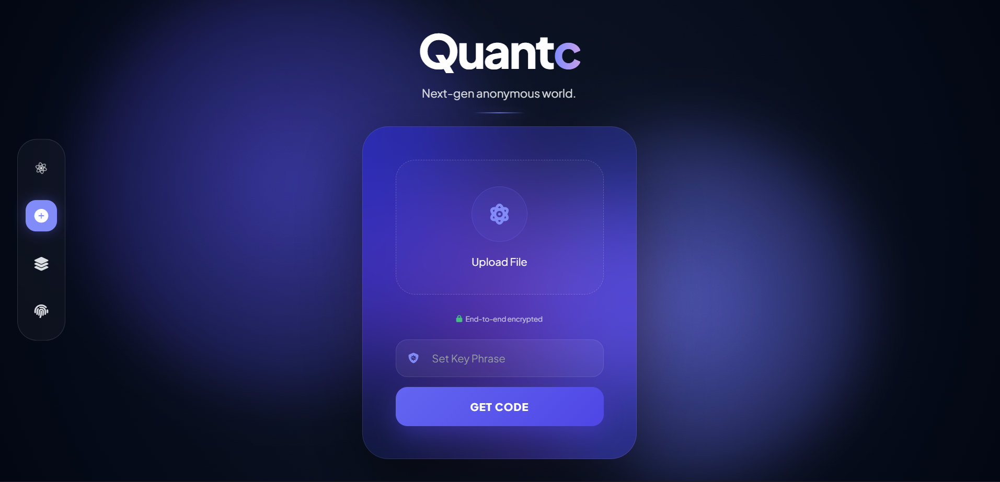
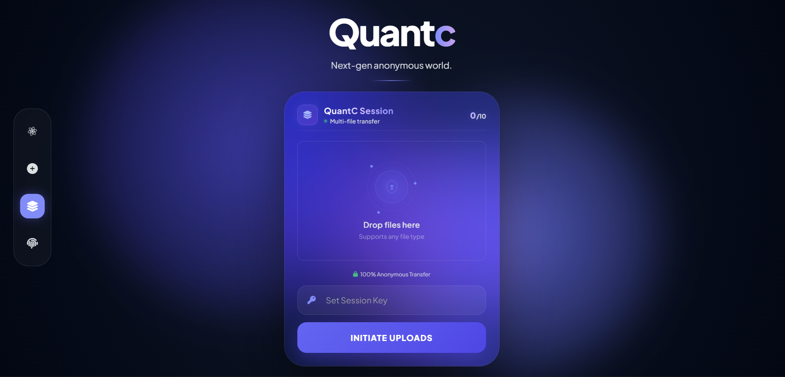
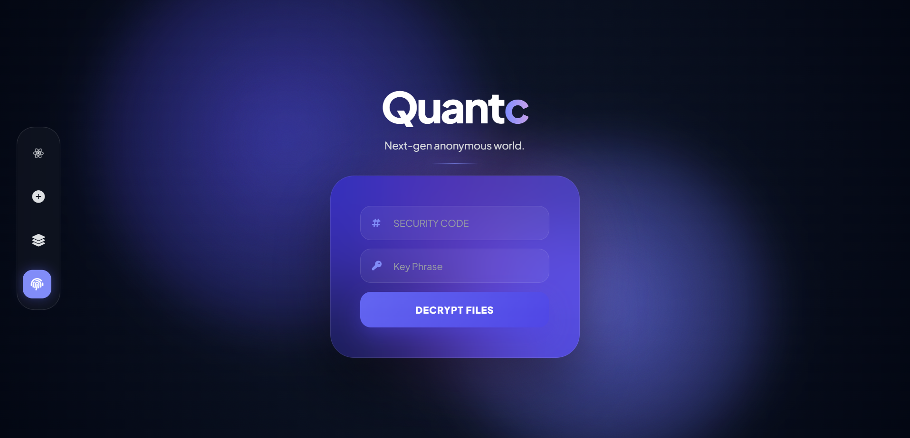
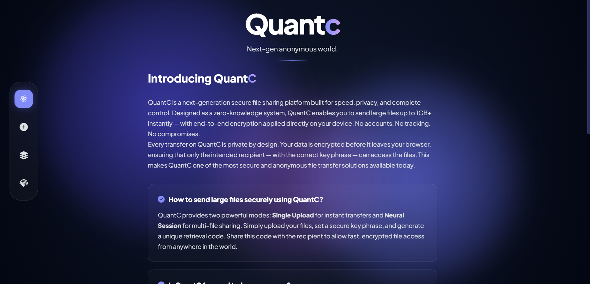

<div align="center">


<br/>

[](https://quantc-arya.vercel.app)

<br/>

<p>
  
  &nbsp;
  
  &nbsp;
  
</p>

<p>
  
  &nbsp;
  
  &nbsp;
  
  &nbsp;
  
</p>

<p>
  
  &nbsp;
  
  &nbsp;
  
  &nbsp;
  
  &nbsp;
  
</p>

<br/>

<a href="https://quantc-arya.vercel.app">
  
</a>

<br/><br/>


<p>
  <a href="#-the-problem"><kbd>&nbsp;🚨&nbsp;Problem&nbsp;</kbd></a>&nbsp;
  <a href="#-enter-quantc"><kbd>&nbsp;🛡️&nbsp;Enter QuantC&nbsp;</kbd></a>&nbsp;
  <a href="#-features"><kbd>&nbsp;✨&nbsp;Features&nbsp;</kbd></a>&nbsp;
  <a href="#-live-demo"><kbd>&nbsp;🚀&nbsp;Demo&nbsp;</kbd></a>&nbsp;
  <a href="#-screenshots"><kbd>&nbsp;📸&nbsp;Screenshots&nbsp;</kbd></a>&nbsp;
  <a href="#-how-it-works"><kbd>&nbsp;🧠&nbsp;How It Works&nbsp;</kbd></a>&nbsp;
  <a href="#-security"><kbd>&nbsp;🔒&nbsp;Security&nbsp;</kbd></a>&nbsp;
  <a href="#-use-cases"><kbd>&nbsp;🌍&nbsp;Use Cases&nbsp;</kbd></a>&nbsp;
  <a href="#-comparison"><kbd>&nbsp;📊&nbsp;Compare&nbsp;</kbd></a>&nbsp;
  <a href="#-roadmap"><kbd>&nbsp;🗺️&nbsp;Roadmap&nbsp;</kbd></a>&nbsp;
  <a href="#-contributing"><kbd>&nbsp;🤝&nbsp;Contribute&nbsp;</kbd></a>
</p>


</div>

<br/>

## 🚨 The Problem

<div align="center">

<table>
<tr>
<td align="center" width="220">
  
  <br/><sub>Every platform demands your identity before you share a single byte.</sub>
</td>
<td align="center" width="220">
  
  <br/><sub>Servers silently read, index, and analyze your private files.</sub>
</td>
<td align="center" width="220">
  
  <br/><sub>Your activity becomes a product that funds surveillance systems.</sub>
</td>
<td align="center" width="220">
  
  <br/><sub>Files stored indefinitely — a permanent, invisible digital trail.</sub>
</td>
</tr>
</table>

</div>

<br/>

<div align="center">

</div>

<br/>

## 🛡️ Enter QuantC

<div align="center">

> ### *"Privacy is not a feature. It's the only way we built it."*

</div>

<br/>

**QuantC** was engineered for a world where your digital identity is the most valuable thing you own — and the most aggressively harvested.

This is not just a file-sharing tool. It's a **privacy fortress** that places the control of your data entirely in your hands. The architecture ensures that even *we* cannot read your files — not as a policy promise, but as a physical architectural constraint.

Built for **journalists · activists · security researchers · developers · whistleblowers · anyone** who believes sharing a file should never require surrendering an identity.

<br/>

<div align="center">
<table>
<tr>
<td align="center" width="20%">
  🕵️<br/>
  <b>Anonymous<br/>by Default</b><br/>
  <sub>No email, no account,<br/>no identity — ever.</sub>
</td>
<td align="center" width="20%">
  🔭<br/>
  <b>Blind<br/>by Design</b><br/>
  <sub>Servers cannot read what<br/>they structurally cannot see.</sub>
</td>
<td align="center" width="20%">
  ☠️<br/>
  <b>Ephemeral<br/>by Nature</b><br/>
  <sub>Files self-destruct at 48h.<br/>No archives. No receipts.</sub>
</td>
<td align="center" width="20%">
  🔑<br/>
  <b>Dual-Key<br/>Protected</b><br/>
  <sub>6-char code + key phrase.<br/>Two secrets. Zero leakage.</sub>
</td>
<td align="center" width="20%">
  ⚡<br/>
  <b>Lightning<br/>Fast</b><br/>
  <sub>1GB+ transfers without<br/>sacrificing any security.</sub>
</td>
</tr>
</table>
</div>

<br/>

<div align="center">

</div>

<br/>

## ✨ Features

<div align="center">
<table>
<tr>
<td width="50%" valign="top">

### 🔐 Military-Grade Encryption
The same protection trusted by security agencies worldwide. Your files are rendered mathematically uncrackable before they ever leave your device.

### 👻 Absolute Anonymity
Zero identity. Zero email. Zero account. You exist nowhere on our platform. We have nothing to hand over — because we never collected anything.

### 🚫 Zero Tracking, Zero Logs
No analytics on you. No behavioral profiling. No IP retention. We structurally cannot surveil you because we don't build that infrastructure.

### 🔑 Dual-Key Retrieval System
Your file is locked by **two independent secrets** — a unique 6-character code and your custom key phrase. Neither alone opens the door.

### 💀 48-Hour Auto-Destruct
Files are permanently and irreversibly purged after 48 hours. No trace. No archive. No recovery path. Completely gone.

### 📦 1GB+ File Support
Send massive files that email and most platforms flat-out refuse. No size guilt. No compression. No quality loss.

</td>
<td width="50%" valign="top">

### 🌍 Universal Browser Support
No app. No plugin. No install. Works on every browser, every device, everywhere — launch and go.

### ⚡ Lightning-Fast Transfers
Speed-optimized from the ground up. Maximum privacy does not mean slow. Both exist in QuantC simultaneously.

### 📡 Two Transfer Modes
**Single Upload** for instant one-off transfers. **Neural Session** for multi-file encrypted batch transfers. Both are completely anonymous.

### 🔒 Client-Side Processing
Encryption lives entirely on your device. Our servers only ever receive encrypted, unreadable data — by architectural design.

### 🧠 Zero-Knowledge Architecture
The server is physically incapable of reading your files. The key never leaves your browser. This is not a promise — it's physics.

### 🆓 Completely Free. Always.
No plans. No tiers. No paywalls. No subscriptions. No upsells. Privacy is a right, not a premium feature.

</td>
</tr>
</table>
</div>

<br/>

<div align="center">

</div>

<br/>

## 🚀 Live Demo

<div align="center">

<br/>

[](https://quantc-arya.vercel.app)

<br/>

<a href="https://quantc-arya.vercel.app">
  
</a>

<br/><br/>

<a href="https://quantc-arya.vercel.app">
  
</a>

<br/><br/>

</div>

<br/>

<div align="center">

</div>

<br/>

## 📸 Screenshots

<br/>

### ◈ Single Upload — Instant Secure Transfer

<div align="center">
  
  <br/>
  <sub><b>Drop a file → Set your key phrase → Get your 6-character code. Done in seconds.</b></sub>
</div>

<br/><br/>

### ◈ Neural Session — Multi-File Batch Transfer

<div align="center">
  
  <br/>
  <sub><b>Load up to 10 files into a single encrypted session. One code. One key. Everything delivered.</b></sub>
</div>

<br/><br/>

### ◈ Retrieve & Decrypt — Recipient's View

<div align="center">
  
  <br/>
  <sub><b>Enter the security code + key phrase. Decryption happens locally — the server is never involved.</b></sub>
</div>

<br/><br/>

### ◈ About QuantC — Platform Philosophy

<div align="center">
  
  <br/>
  <sub><b>Transparent, honest, and privacy-first by design. Everything you need to know — nothing hidden.</b></sub>
</div>

<br/>

> 📌 **Setup screenshots:** Create a `screenshots/` folder in your repo root and add `upload-single.png`, `upload-session.png`, `retrieve.png`, `about.png`.

<br/>

<div align="center">

</div>

<br/>

## 🧠 How It Works

<br/>

### 📤 Sender — 5 Steps to Invisible Transfer

<div align="center">

| Step | Action | What Happens |
|:----:|:-------|:-------------|
| `01` | **Drop your file** into QuantC | File is selected locally — nothing moves yet |
| `02` | **Set a secret key phrase** | Your chosen password — we never see or store this |
| `03` | **Click Encrypt & Upload** | File is encrypted on your device, then transmitted as unreadable data |
| `04` | **Receive your 6-char code** | A unique retrieval code is generated and shown only to you |
| `05` | **Share code + key phrase** | Send both to your recipient via any secure out-of-band channel |

</div>

<br/>

### 📥 Recipient — 3 Steps to Secure Access

<div align="center">

| Step | Action | What Happens |
|:----:|:-------|:-------------|
| `01` | **Open QuantC** in browser | No login. No account. Navigate straight to Retrieve |
| `02` | **Enter the 6-char code + key phrase** | Two independent factors — both required to unlock |
| `03` | **Decryption runs locally → Download** | Browser decrypts entirely on your device. File restored perfectly. |

</div>

<br/>

### 🔄 The Full Data Journey

<div align="center">
<br/>

```
  YOUR DEVICE                    QUANTC SERVER                 RECIPIENT'S DEVICE

  📁 Original File
       │
       ▼
  🔐 Encrypted in Browser  ────►  🔒 Encrypted Shards         🔐 Decrypted Locally
     (key never leaves here)       (server is blind)           Code:  X7K2PQ  +
                                   🎲 Code: [ X7K2PQ ]         Key:   ••••••••
                                   ⏳ Auto-purges 48h                │
                                         │                            ▼
                                         └── Encrypted only ───►  ✅ Original File
                                                                      Restored
```

</div>

<br/>

<div align="center">

</div>

<br/>

## 🔒 Security

<br/>

<div align="center">
<table>
<tr>
<td align="center" width="33%">

### 🛡️ Layer 1
**Client-Side Encryption**

Encryption runs entirely on your device before any data is transmitted. Your key phrase **never** touches our servers — not even for a millisecond.

</td>
<td align="center" width="33%">

### 🌐 Layer 2
**Zero-Knowledge Transit**

Only encrypted, unreadable data crosses the network. Intercepting the transmission yields nothing — there is no key attached to the data in transit.

</td>
<td align="center" width="33%">

### 🧱 Layer 3
**Structurally Blind Server**

Our servers store only encrypted shards. They cannot decrypt them. This is not a policy — it's how the architecture physically operates.

</td>
</tr>
<tr>
<td align="center">

### 🔑 Layer 4
**Dual-Factor Retrieval**

Files require both the 6-character code AND the key phrase to unlock. Two independent secrets — one alone is completely useless.

</td>
<td align="center">

### ☠️ Layer 5
**Temporal Self-Destruct**

At 48 hours, files are permanently and irreversibly purged from all infrastructure. No backups. No recovery. No trace.

</td>
<td align="center">

### 👤 Layer 6
**Zero-Identity Architecture**

No accounts. No emails. No IPs logged. There is simply no data about you to steal, subpoena, or hand over — to anyone.

</td>
</tr>
</table>
</div>

<br/>

<div align="center">

| 🛡️ What We Protect | Status | 🚫 What We Never Do | Status |
|:---|:---:|:---|:---:|
| Your file contents | ✅ Always encrypted | Create user accounts | ❌ Never |
| Your identity | ✅ Never collected | Collect email addresses | ❌ Never |
| Your IP address | ✅ Not logged | Store access logs | ❌ Never |
| Your key phrase | ✅ Never transmitted | Embed third-party trackers | ❌ Never |
| Your usage behavior | ✅ Zero analytics | Sell data to anyone | ❌ Never |
| Your file metadata | ✅ Not exposed | Read your files | ❌ Never |

</div>

<br/>

> [!NOTE]
> **The Trust Guarantee:** QuantC is designed so that even a full server compromise yields **nothing useful** — only encrypted shards with no associated keys anywhere on the system. Trust is not a policy. It's the architecture.

<br/>

<div align="center">

</div>

<br/>

## 📊 Comparison

<div align="center">

| Feature | **QuantC** | Google Drive | WeTransfer | Dropbox | Email |
|:--------|:----------:|:------------:|:----------:|:-------:|:-----:|
| Zero-Knowledge Architecture | ✅ | ❌ | ❌ | ❌ | ❌ |
| 100% Anonymous | ✅ | ❌ | ❌ | ❌ | ❌ |
| No Account Required | ✅ | ❌ | ⚠️ | ❌ | ❌ |
| Server Never Reads Files | ✅ | ❌ | ❌ | ❌ | ❌ |
| Client-Side Encryption | ✅ | ❌ | ❌ | ❌ | ❌ |
| IP Not Logged | ✅ | ❌ | ❌ | ❌ | ❌ |
| Auto-Expiry (48h) | ✅ | ❌ | ⚠️ | ❌ | ❌ |
| 1GB+ Support Free | ✅ | ❌ | ❌ | ❌ | ❌ |
| Zero Tracking | ✅ | ❌ | ❌ | ❌ | ❌ |
| No Third-Party Embeds | ✅ | ❌ | ❌ | ❌ | ❌ |
| Free Forever | ✅ | ⚠️ | ⚠️ | ⚠️ | ⚠️ |

</div>

<br/>

<div align="center">

</div>

<br/>

## 🌍 Use Cases

<div align="center">
<table>
<tr>
<td align="center" width="25%">
<br/>

**📰 Journalists**

Share sensitive source documents, investigation files, or recordings without creating a traceable digital footprint.

<br/>
</td>
<td align="center" width="25%">
<br/>

**⚖️ Legal Professionals**

Transfer confidential case files and privileged communications without exposing client identity.

<br/>
</td>
<td align="center" width="25%">
<br/>

**💻 Security Researchers**

Exchange vulnerability disclosures and research data in environments where privacy is non-negotiable.

<br/>
</td>
<td align="center" width="25%">
<br/>

**🌍 Activists**

Communicate and share evidence freely, even in regions with digital surveillance, without identity exposure.

<br/>
</td>
</tr>
<tr>
<td align="center">
<br/>

**🏢 Privacy-First Teams**

Share proprietary files and sensitive business data without routing through third-party cloud infrastructure.

<br/>
</td>
<td align="center">
<br/>

**🧑‍💻 Developers**

Transfer credentials, secrets, configs, and API keys without leaving traces in email threads or chat history.

<br/>
</td>
<td align="center">
<br/>

**🔓 Whistleblowers**

Deliver evidence to journalists or authorities without risking identity, location, or device exposure.

<br/>
</td>
<td align="center">
<br/>

**👤 Anyone**

You don't need a reason to want privacy. QuantC is for everyone who believes their files belong only to them.

<br/>
</td>
</tr>
</table>
</div>

<br/>

<div align="center">

</div>

<br/>

## 🛠 Tech Stack

<div align="center">

<p>
  
  &nbsp;
  
  &nbsp;
  
</p>

<p>
  
  &nbsp;
  
  &nbsp;
  
</p>

| Layer | Technology | Purpose |
|:------|:-----------|:--------|
| 🔐 Encryption | Web Crypto API + AES-256-GCM | Client-side file encryption before upload |
| 🌐 Frontend | Vanilla JS / HTML5 / CSS3 | Zero-dependency, fully browser-native |
| 🖥️ Backend | Node.js | Encrypted shard relay — structurally blind |
| 📦 Storage | Ephemeral temporary storage | 48-hour TTL with automatic purge |
| 🚀 Hosting | Vercel | Global CDN, edge-optimized deployment |
| 🔑 Key Derivation | Browser-native | Key phrase processed locally — never transmitted |

</div>

<br/>

<div align="center">

</div>

<br/>

## 🗺️ Roadmap

<div align="center">

| Status | Feature | Phase |
|:------:|:--------|:-----:|
| ✅ | Core zero-knowledge upload engine | `v1.0` |
| ✅ | Client-side encryption system | `v1.0` |
| ✅ | 6-char code + key phrase dual-factor retrieval | `v1.0` |
| ✅ | 48-hour auto-expiry + permanent purge | `v1.0` |
| ✅ | Single Upload mode | `v1.0` |
| ✅ | Neural Session multi-file mode | `v1.0` |
| ✅ | 1GB+ large file support | `v1.0` |
| 🔄 | Independent security audit | `v1.1` |
| 🔄 | Performance optimization for 2GB+ | `v1.1` |
| 🔄 | Mobile PWA experience | `v1.1` |
| 📋 | Optional Tor / onion routing | `v1.2` |
| 📋 | Configurable expiry windows (1h / 6h / 24h / 48h) | `v1.2` |
| 📋 | Multi-language (i18n) support | `v1.3` |
| 📋 | Browser extension | `v1.3` |
| 💡 | P2P / WebRTC fully serverless mode | `v2.0` |
| 💡 | Zero-knowledge proof audit trail | `v2.0` |
| 💡 | Enterprise self-hosted edition | `v2.0` |

</div>

<br/>

<div align="center">

</div>

<br/>

## 🤝 Contributing

We welcome contributors who care about privacy. QuantC's mission is community-driven.

<div align="center">

| Area | What We're Looking For |
|:-----|:-----------------------|
| 🔐 **Security** | Encryption improvements, vulnerability research, audits |
| ⚡ **Performance** | Transfer speed, optimization, memory efficiency |
| 🎨 **Design** | UI/UX polish, accessibility, mobile experience |
| 📖 **Documentation** | Guides, translations, examples, tutorials |
| 🧪 **Testing** | Unit tests, integration tests, security fuzzing |
| 🌍 **i18n** | Translations for global privacy advocates |

</div>

<br/>

> [!WARNING]
> **Found a security vulnerability?** Do **NOT** open a public GitHub issue.
> Email us privately at `goglemaleyou@gmail.com` — we respond within 48 hours.
> Responsible disclosure is always credited publicly.

<br/>

<div align="center">

</div>

<br/>

## 📜 License

<div align="center">

This project is licensed under the **MIT License** — see the [LICENSE](LICENSE) file for full details.


&nbsp;


</div>

<br/>

---

<div align="center">

<br/>

[](https://quantc-arya.vercel.app)

<br/>

> **QuantC gives you the power to communicate freely — without asking for anything in return.**
> No account. No tracking. No compromise. No excuses.

<br/>

### ⚡ Ready to disappear?

<br/>

<a href="https://quantc-arya.vercel.app">
  
</a>

<br/><br/>

<a href="https://quantc-arya.vercel.app">
  
</a>

<br/><br/>

<p>
  
  &nbsp;
  
</p>

<sub>If QuantC matters to you — ⭐ star it, share it, use it. Privacy wins when more people choose it.</sub>

<br/><br/>


</div>
